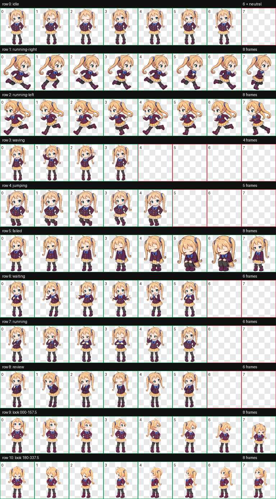
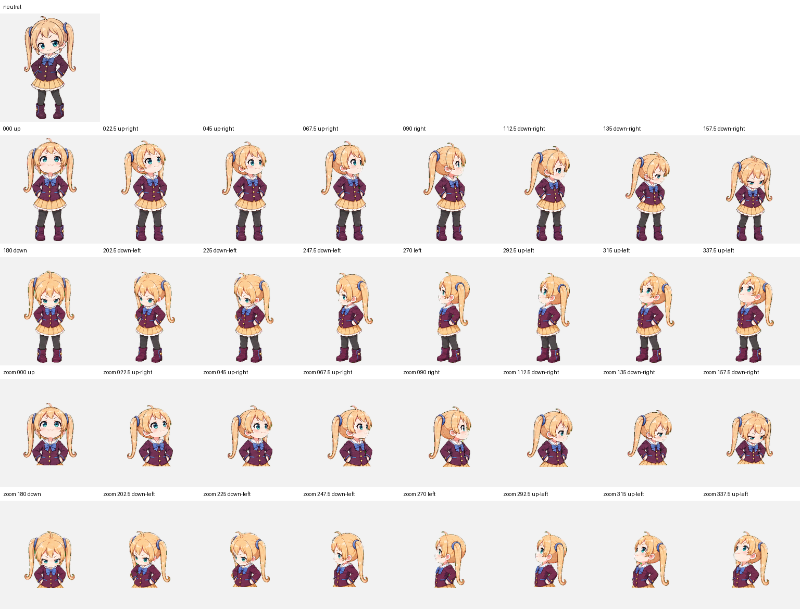

# Dekomori — Codex Animated Pet

<p align="center">
  
</p>

Dekomori is an original, playful, delightfully eccentric academy chibi girl with sandy-blonde question-mark twin tails, wide teal-blue eyes, a deep-plum sailor-inspired jacket, cornflower-blue details, and a pale-gold pleated skirt. Her mischievous expression and compact silhouette stay readable at pet size. She is packaged as a Codex sprite v2 pet with nine standard animation states and sixteen clockwise look directions.

데코모리는 물음표처럼 안쪽으로 말린 모래빛 금발 트윈테일과 커다란 청록빛 눈, 짙은 자두색 세라복풍 재킷, 수레국화색 포인트, 연한 금빛 플리츠스커트가 특징인 오리지널 치비 캐릭터입니다. 장난스럽고 엉뚱한 표정과 간결한 실루엣이 작은 펫 크기에서도 선명하게 보입니다. Codex sprite v2 규격의 아홉 가지 기본 애니메이션과 열여섯 방향 시선을 지원합니다.

## Highlights

- Codex sprite contract: v2
- Atlas: `1536 × 2288` WebP with transparency
- Cell size: `192 × 208`
- Layout: 8 columns × 11 rows
- Standard states: idle, drag right, drag left, wave, jump, failed, waiting, working, review
- Look loop: 16 directions in 22.5-degree steps
- Public QA: atlas validation, three-reviewer blind direction validation, and independent final visual QA

## Animation previews

| Idle | Drag right | Drag left |
| --- | --- | --- |
|  |  |  |

| Wave | Jump | Failed |
| --- | --- | --- |
|  |  |  |

| Waiting for input | Working | Review |
| --- | --- | --- |
|  |  |  |

## Full sprite and look-direction previews

<details>
<summary>Open the complete 8 × 11 animation sheet</summary>



</details>

<details>
<summary>Open the neutral + 16-direction QA sheet</summary>



</details>

## Install

From the repository root on macOS or Linux:

```bash
mkdir -p "$HOME/.codex/pets/dekomori"
cp "Dekomori/pet.json" "$HOME/.codex/pets/dekomori/pet.json"
cp "Dekomori/spritesheet.webp" "$HOME/.codex/pets/dekomori/spritesheet.webp"
```

Restart or refresh the Codex desktop app if Dekomori does not appear immediately.

To uninstall:

```bash
rm -rf "$HOME/.codex/pets/dekomori"
```

## Required package files

Only these files are required by Codex:

```text
Dekomori/
├── pet.json
└── spritesheet.webp
```

The `previews`, `screenshots`, and `qa` folders are documentation and verification artifacts for repository visitors.

## Verification

The published package passed the following checks:

- `spriteVersionNumber: 2`
- WebP RGBA, `1536 × 2288`
- 8 columns × 11 rows
- Transparent RGB residue: 0 pixels
- Atlas errors and warnings: none
- Both cardinal blind-review gates passed by strict three-reviewer majority
- Every horizontal intermediate direction passed blind review
- The `067.5` and `292.5` intermediate vertical cues were subtle in blind review, then accepted by labeled ordered-loop review
- All sixteen labeled look directions passed or passed with reviewed warnings; none failed
- Continuity outliers were accepted as natural frontal/profile occlusion and head-pitch changes after confirming stable anatomy, baseline, identity, and twin-tail attachment
- Published package and key screenshot checksums are listed in [`SHA256SUMS`](SHA256SUMS)

See [`qa/validation.json`](qa/validation.json), [`qa/direction-blind-validation.json`](qa/direction-blind-validation.json), and [`qa/final-visual-qa.json`](qa/final-visual-qa.json) for the public QA summaries.

## License

The package uses two licenses:

- `pet.json`, this README, `SHA256SUMS`, and files in `qa/` are available under the [MIT License](../LICENSES/MIT.txt).
- `spritesheet.webp`, images in `screenshots/`, and animations in `previews/` are available under [CC BY 4.0](../LICENSES/CC-BY-4.0.md).

When sharing or adapting Dekomori's visual assets, use this attribution where practical:

> Dekomori Codex Pet by Ryu JaeHyun, licensed under CC BY 4.0.

See the repository's [license overview](../LICENSE.md) for details.
