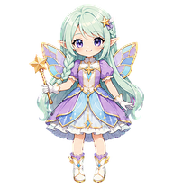
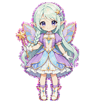
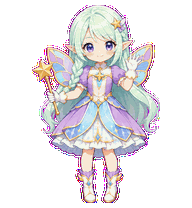
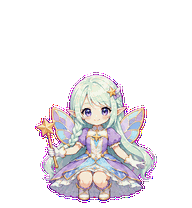
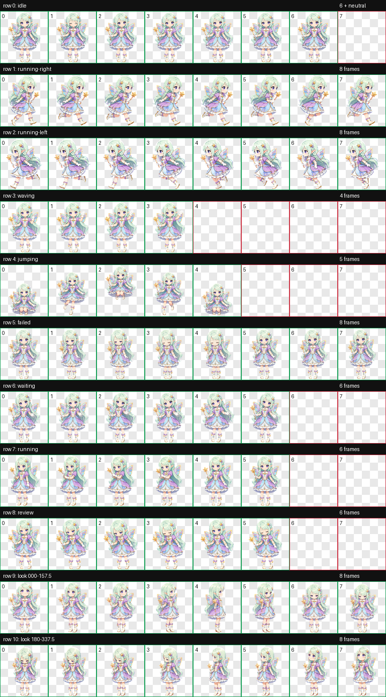
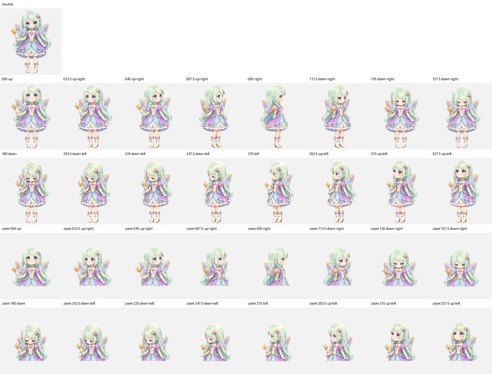

# Lumi — Codex Animated Pet

<p align="center">
  
</p>

Lumi is a bright and brave fairy magical girl with pale mint hair, a side braid, pointed ears, violet-blue eyes, jewel-like wings, a lavender-and-sky-blue dress, and a small golden star wand. Her original chibi design is inspired by the visual language of Japanese animation without reproducing an existing franchise character. She is packaged as a Codex sprite v2 pet with nine standard animation states and sixteen clockwise look directions.

루미는 민트빛 머리와 옆으로 땋은 머리, 뾰족한 요정 귀, 보랏빛 푸른 눈, 보석 같은 날개, 라벤더·하늘색 드레스와 작은 금빛 별 마법봉이 특징인 밝고 용감한 마법소녀 펫입니다. 특정 작품의 캐릭터를 복제하지 않은 오리지널 치비 디자인이며, Codex sprite v2 규격의 아홉 가지 기본 애니메이션과 열여섯 방향 시선을 지원합니다.

## Highlights

- Codex sprite contract: v2
- Atlas: `1536 × 2288` WebP with transparency
- Cell size: `192 × 208`
- Layout: 8 columns × 11 rows
- Standard states: idle, drag right, drag left, wave, jump, failed, waiting, working, review
- Look loop: 16 directions in 22.5-degree steps
- Public QA: atlas validation, three-reviewer blind direction validation, and independent final visual QA

## Animation previews

| Idle | Drag right | Drag left |
| --- | --- | --- |
|  |  |  |

| Wave | Jump | Failed |
| --- | --- | --- |
|  |  |  |

| Waiting for input | Working | Review |
| --- | --- | --- |
|  |  |  |

## Full sprite and look-direction previews

<details>
<summary>Open the complete 8 × 11 animation sheet</summary>



</details>

<details>
<summary>Open the neutral + 16-direction QA sheet</summary>



</details>

## Install

From the repository root on macOS or Linux:

```bash
mkdir -p "$HOME/.codex/pets/lumi"
cp "Lumi/pet.json" "$HOME/.codex/pets/lumi/pet.json"
cp "Lumi/spritesheet.webp" "$HOME/.codex/pets/lumi/spritesheet.webp"
```

Restart or refresh the Codex desktop app if Lumi does not appear immediately.

To uninstall:

```bash
rm -rf "$HOME/.codex/pets/lumi"
```

## Required package files

Only these files are required by Codex:

```text
Lumi/
├── pet.json
└── spritesheet.webp
```

The `previews`, `screenshots`, and `qa` folders are documentation and verification artifacts for repository visitors.

## Verification

The published package passed the following checks:

- `spriteVersionNumber: 2`
- WebP RGBA, `1536 × 2288`
- 8 columns × 11 rows
- Transparent RGB residue: 0 pixels
- Atlas errors and warnings: none
- Both cardinal blind-review gates passed by strict majority
- Near-cardinal intermediate cues were subtle in isolated blind review, then accepted by the labeled ordered-loop review
- The repaired jump uses a stable character scale and a visible crouch–rise–apex–fall–crouch arc
- All sixteen labeled look directions passed or passed with reviewed warnings; none failed
- Published package and key screenshot checksums are listed in [`SHA256SUMS`](SHA256SUMS)

See [`qa/validation.json`](qa/validation.json), [`qa/direction-blind-validation.json`](qa/direction-blind-validation.json), and [`qa/final-visual-qa.json`](qa/final-visual-qa.json) for the public QA summaries.

## License

The package uses two licenses:

- `pet.json`, this README, `SHA256SUMS`, and files in `qa/` are available under the [MIT License](../LICENSES/MIT.txt).
- `spritesheet.webp`, images in `screenshots/`, and animations in `previews/` are available under [CC BY 4.0](../LICENSES/CC-BY-4.0.md).

When sharing or adapting Lumi's visual assets, use this attribution where practical:

> Lumi Codex Pet by Ryu JaeHyun, licensed under CC BY 4.0.

See the repository's [license overview](../LICENSE.md) for details.
