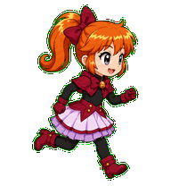
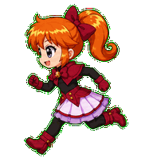
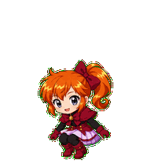
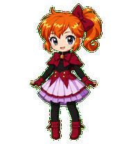
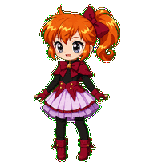
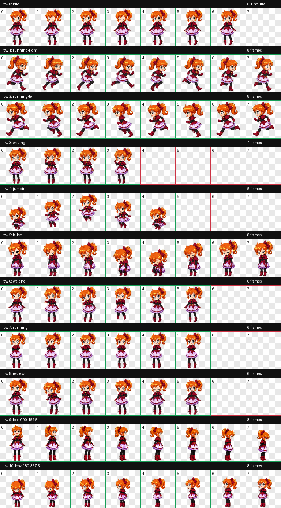
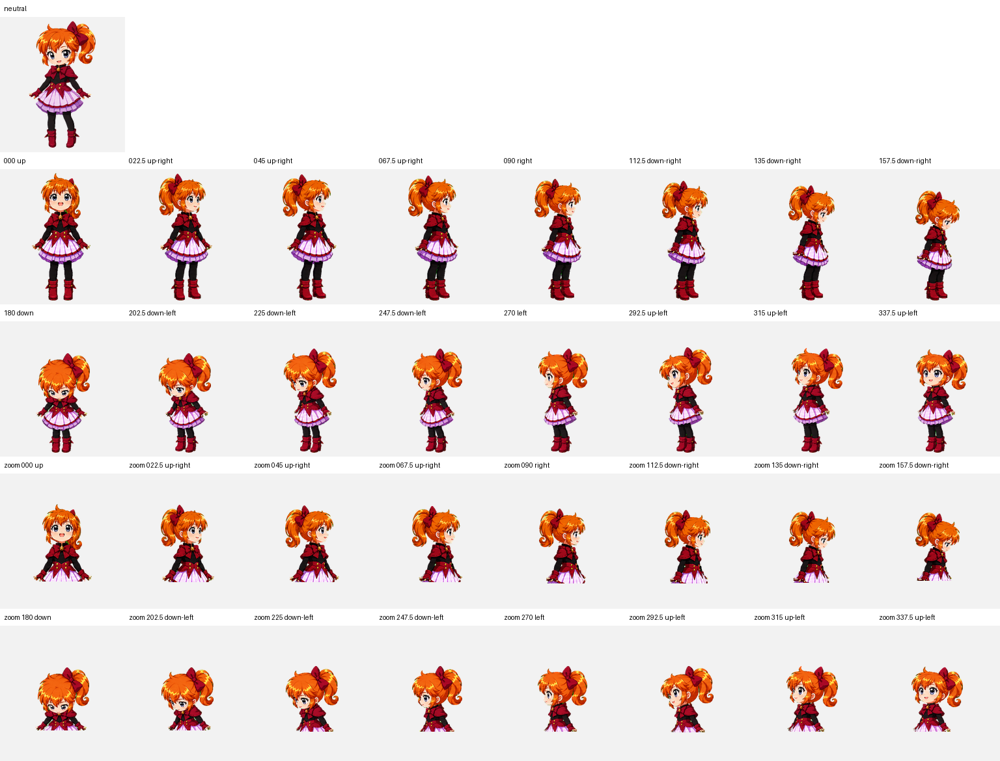

# Neti — Codex Animated Pet

<p align="center">
  
</p>

Neti is an original, clever magical-thief chibi girl with a copper-orange high side ponytail, a dark-cherry bow, gray-blue eyes, and a burgundy, black, and pale-lavender outfit. Her playful smile, tiny gold bell brooch, opaque leggings, gloves, and ankle boots keep the silhouette expressive and readable at pet size. She is packaged as a Codex sprite v2 pet with nine standard animation states and sixteen clockwise look directions.

네티는 구릿빛 주황색 하이 사이드 포니테일과 짙은 체리색 리본, 회청색 눈, 버건디·검정·연보라색 의상이 특징인 영리하고 장난기 있는 오리지널 마법 괴도풍 치비 캐릭터입니다. 작은 금빛 방울 브로치와 레깅스, 장갑, 앵클부츠를 사용해 작은 펫 크기에서도 실루엣이 선명하게 보입니다. Codex sprite v2 규격의 아홉 가지 기본 애니메이션과 열여섯 방향 시선을 지원합니다.

## Highlights

- Codex sprite contract: v2
- Atlas: `1536 × 2288` WebP with transparency
- Cell size: `192 × 208`
- Layout: 8 columns × 11 rows
- Standard states: idle, drag right, drag left, wave, jump, failed, waiting, working, review
- Look loop: 16 directions in 22.5-degree steps
- Public QA: atlas validation, three-reviewer blind direction validation, and independent final visual QA

## Animation previews

| Idle | Drag right | Drag left |
| --- | --- | --- |
|  |  |  |

| Wave | Jump | Failed |
| --- | --- | --- |
|  |  |  |

| Waiting for input | Working | Review |
| --- | --- | --- |
|  |  |  |

## Full sprite and look-direction previews

<details>
<summary>Open the complete 8 × 11 animation sheet</summary>



</details>

<details>
<summary>Open the neutral + 16-direction QA sheet</summary>



</details>

## Install

From the repository root on macOS or Linux:

```bash
mkdir -p "$HOME/.codex/pets/neti"
cp "Neti/pet.json" "$HOME/.codex/pets/neti/pet.json"
cp "Neti/spritesheet.webp" "$HOME/.codex/pets/neti/spritesheet.webp"
```

Restart or refresh the Codex desktop app if Neti does not appear immediately.

To uninstall:

```bash
rm -rf "$HOME/.codex/pets/neti"
```

## Required package files

Only these files are required by Codex:

```text
Neti/
├── pet.json
└── spritesheet.webp
```

The `previews`, `screenshots`, and `qa` folders are documentation and verification artifacts for repository visitors.

## Verification

The published package passed the following checks:

- `spriteVersionNumber: 2`
- WebP RGBA, `1536 × 2288`
- 8 columns × 11 rows
- Transparent RGB residue: 0 pixels
- Atlas errors and warnings: none
- Both cardinal blind-review gates passed by strict three-reviewer majority
- The `112.5` and `247.5` intermediate vertical cues were subtle in blind review, then accepted by labeled ordered-loop review
- All sixteen labeled look directions passed or passed with reviewed warnings; none failed
- Continuity outliers were accepted after the ordered loop showed stable feet, height, scale, and ponytail attachment
- Published package and key screenshot checksums are listed in [`SHA256SUMS`](SHA256SUMS)

See [`qa/validation.json`](qa/validation.json), [`qa/direction-blind-validation.json`](qa/direction-blind-validation.json), and [`qa/final-visual-qa.json`](qa/final-visual-qa.json) for the public QA summaries.

## License

The package uses two licenses:

- `pet.json`, this README, `SHA256SUMS`, and files in `qa/` are available under the [MIT License](../LICENSES/MIT.txt).
- `spritesheet.webp`, images in `screenshots/`, and animations in `previews/` are available under [CC BY 4.0](../LICENSES/CC-BY-4.0.md).

When sharing or adapting Neti's visual assets, use this attribution where practical:

> Neti Codex Pet by Ryu JaeHyun, licensed under CC BY 4.0.

See the repository's [license overview](../LICENSE.md) for details.
