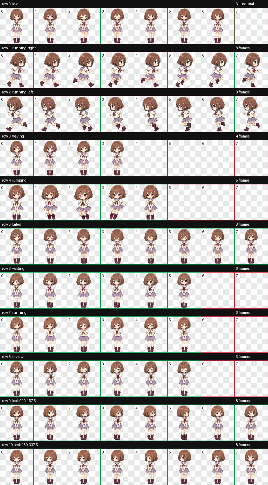
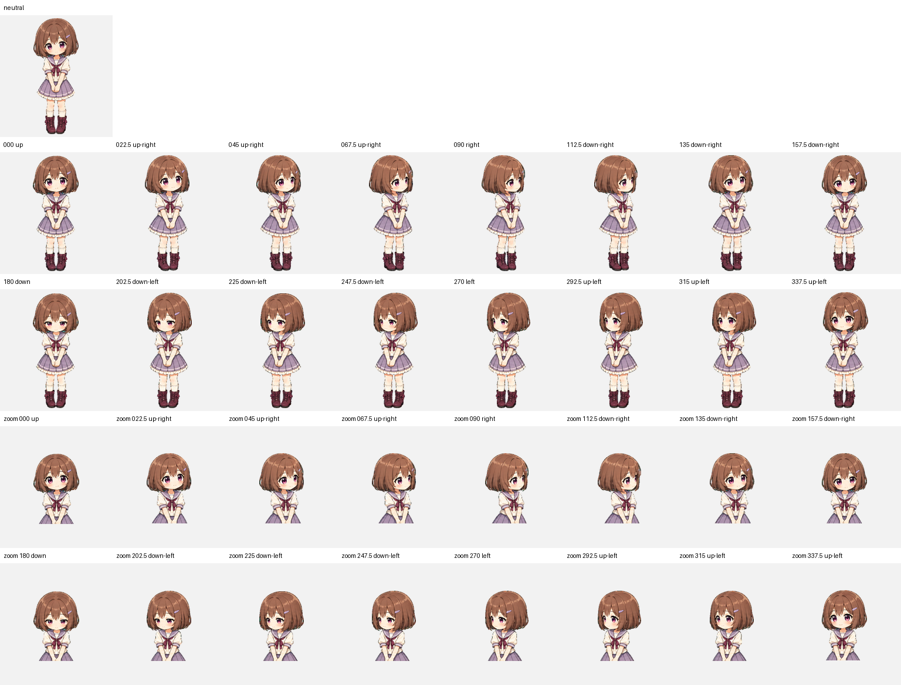

# Rina — Codex Animated Pet

<p align="center">
  
</p>

Rina is Miyu and Hina's shy sister, with a short chestnut-brown bob, a small lavender hair clip, rose-violet eyes, warm blush, and a lavender-and-ivory sailor-style outfit. She is packaged as a Codex sprite v2 pet with nine standard animation states and sixteen clockwise look directions.

리나는 미유와 히나의 자매로, 밤색 단발머리와 작은 라벤더 머리핀, 장밋빛 보라색 눈, 붉어진 볼, 라벤더·아이보리 세라복, 두 손을 모은 수줍은 몸짓이 특징입니다. Codex sprite v2 규격의 아홉 가지 기본 애니메이션과 열여섯 방향 시선을 지원합니다.

## Highlights

- Codex sprite contract: v2
- Atlas: `1536 × 2288` WebP with transparency
- Cell size: `192 × 208`
- Layout: 8 columns × 11 rows
- Standard states: idle, drag right, drag left, wave, jump, failed, waiting, working, review
- Look loop: 16 directions in 22.5-degree steps
- Public QA: atlas validation, three-reviewer blind direction validation, and independent final visual QA

## Animation previews

| Idle | Drag right | Drag left |
| --- | --- | --- |
|  |  |  |

| Wave | Jump | Failed |
| --- | --- | --- |
|  |  |  |

| Waiting for input | Working | Review |
| --- | --- | --- |
|  |  |  |

## Full sprite and look-direction previews

<details>
<summary>Open the complete 8 × 11 animation sheet</summary>



</details>

<details>
<summary>Open the neutral + 16-direction QA sheet</summary>



</details>

## Install

From the repository root on macOS or Linux:

```bash
mkdir -p "$HOME/.codex/pets/rina"
cp "Rina/pet.json" "$HOME/.codex/pets/rina/pet.json"
cp "Rina/spritesheet.webp" "$HOME/.codex/pets/rina/spritesheet.webp"
```

Restart or refresh the Codex desktop app if Rina does not appear immediately.

To uninstall:

```bash
rm -rf "$HOME/.codex/pets/rina"
```

## Required package files

Only these files are required by Codex:

```text
Rina/
├── pet.json
└── spritesheet.webp
```

The `previews`, `screenshots`, and `qa` folders are documentation and verification artifacts for repository visitors.

## Verification

The published package passed the following checks:

- `spriteVersionNumber: 2`
- WebP RGBA, `1536 × 2288`
- 8 columns × 11 rows
- Transparent RGB residue: 0 pixels
- Atlas errors and warnings: none
- Both cardinal blind-review gates passed by strict majority
- The `157.5` and `337.5` intermediate horizontal cues were subtle in blind review, then accepted by the labeled ordered-loop review
- All sixteen labeled look directions passed or passed with reviewed warnings; none failed
- Published package and key screenshot checksums are listed in [`SHA256SUMS`](SHA256SUMS)

See [`qa/validation.json`](qa/validation.json), [`qa/direction-blind-validation.json`](qa/direction-blind-validation.json), and [`qa/final-visual-qa.json`](qa/final-visual-qa.json) for the public QA summaries.

## License

The package uses two licenses:

- `pet.json`, this README, `SHA256SUMS`, and files in `qa/` are available under the [MIT License](../LICENSES/MIT.txt).
- `spritesheet.webp`, images in `screenshots/`, and animations in `previews/` are available under [CC BY 4.0](../LICENSES/CC-BY-4.0.md).

When sharing or adapting Rina's visual assets, use this attribution where practical:

> Rina Codex Pet by Ryu JaeHyun, licensed under CC BY 4.0.

See the repository's [license overview](../LICENSE.md) for details.
